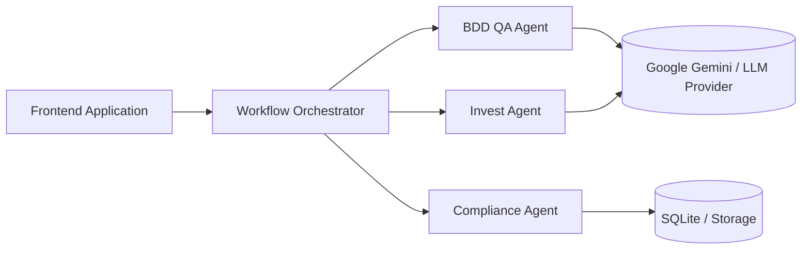

# TALP Multi-Agent AI Platform

TALP is a multi-agent AI platform that evaluates and transforms user stories through an INVEST agent, a compliance analysis agent, a BDD QA agent, and a workflow orchestrator with human-in-the-loop review.

## Main Features

- INVEST quality analysis of user stories.
- Compliance rule validation driven by a catalog and persisted runs.
- BDD scenario generation and refinement guidance.
- Workflow orchestration across agents through REST APIs.
- Frontend review flow for submission, human approval, editing, and final export.

## High-Level Architecture



## Quick Start

1. Set up Python 3.11+, Node.js 20+, Docker, and Docker Compose.
2. Configure environment variables using the examples in [docs/deployment.md](docs/deployment.md).
3. Launch the full stack from the repository root with `docker compose up --build`, or run the services independently in development mode.
4. Open the frontend, submit a user story, review the analyses, approve the edited story, and inspect the final BDD output.

## LLM Providers Setup

This platform uses Google Gemini by default for AI-powered Invest and BDD analysis.
Both agents can also be switched together to OpenRouter through shared
`LLM_*` settings.

### Google Gemini

1. Access Google AI Studio: https://aistudio.google.com
2. Sign in with your Google account.
3. Navigate to **Get API Key**.
4. Create a new API key.
5. Add the key as the shared Gemini credential:

```env
GOOGLE_API_KEY=...
# Optional legacy alias:
# GEMINI_API_KEY=...
```

### OpenRouter

To use OpenRouter for both Invest and BDD:

```env
LLM_PROVIDER=openrouter
OPENROUTER_API_KEY=...
# Optional:
# LLM_MODEL=google/gemini-2.5-flash
```

When `LLM_PROVIDER=gemini`, both LLM-backed agents use Gemini. When
`LLM_PROVIDER=openrouter`, both use OpenRouter unless an agent-specific override
is set. Legacy `TALP_LLM_*` variables are still accepted for compatibility.

## Documentation Index

- [Architecture](docs/architecture.md)
- [Deployment](docs/deployment.md)
- [API Reference](docs/api-reference.md)
- [Workflow](docs/workflow.md)
- [Development Guide](docs/development-guide.md)
- [Troubleshooting](docs/troubleshooting.md)
- [Diagrams](docs/diagrams.md)
