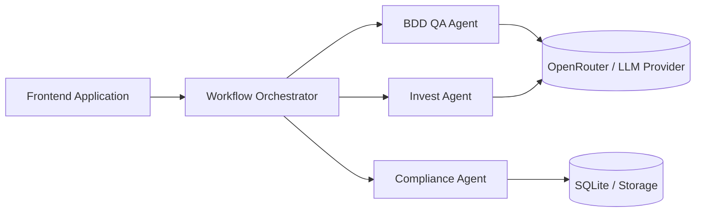

# TALP Multi-Agent AI Platform

TALP is a multi-agent AI platform that evaluates and transforms user stories through an INVEST agent, a compliance analysis agent, a BDD QA agent, and a workflow orchestrator with human-in-the-loop review.

## Main Features

- INVEST quality analysis of user stories.
- Compliance rule validation driven by a catalog and persisted runs.
- BDD scenario generation and refinement guidance.
- Workflow orchestration across agents through REST APIs.
- Frontend review flow for submission, human approval, editing, and final export.

## High-Level Architecture

## Quick Start

1. Set up Python 3.11+, Node.js 20+, Docker, and Docker Compose.
2. Configure environment variables using the examples in [docs/deployment.md](docs/deployment.md).
3. Launch the full stack from the repository root with `docker compose up --build`, or run the services independently in development mode.
4. Open the frontend, submit a user story, review the analyses, approve the edited story, and inspect the final BDD output.

## Documentation Index

- [Architecture](docs/architecture.md)
- [Deployment](docs/deployment.md)
- [API Reference](docs/api-reference.md)
- [Workflow](docs/workflow.md)
- [Development Guide](docs/development-guide.md)
- [Troubleshooting](docs/troubleshooting.md)
- [Diagrams](docs/diagrams.md)
