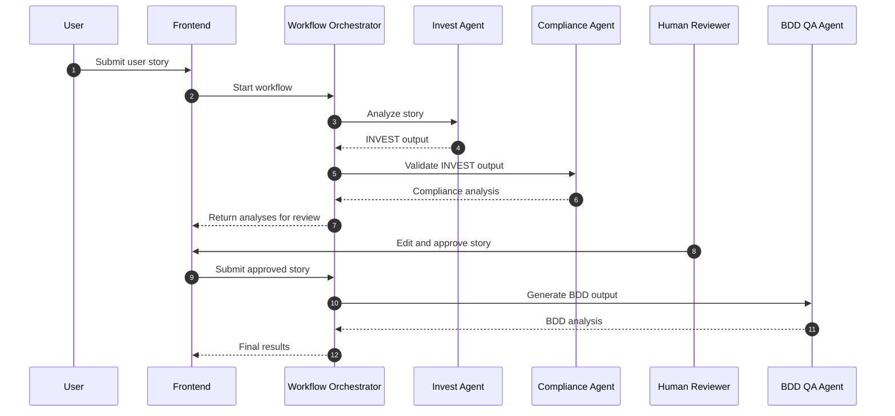
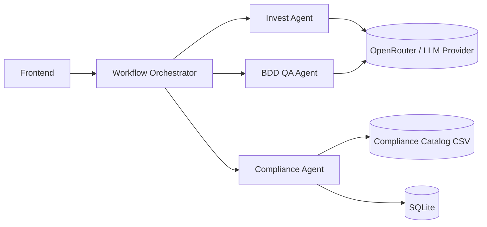

# Architecture

## Project Overview

TALP is a production-grade proof-of-concept for a multi-agent AI platform that turns a user story into a validated, reviewable, and testable delivery artifact.

### Purpose of the platform

The platform evaluates user stories from multiple perspectives:

- **INVEST quality** to check whether the story is independent, negotiable, valuable, estimable, small, and testable.
- **Compliance validation** to compare the story and its INVEST output against a curated rules catalog.
- **Human review** to keep a person in the loop before the final BDD phase.
- **BDD generation** to convert the approved story into executable test design guidance.

### Problem being solved

Teams often write user stories that are incomplete, ambiguous, or non-compliant, and they discover the gaps too late in the delivery cycle. This repository addresses that by combining multiple specialized agents into a single orchestration flow with a manual approval checkpoint.

### Main objectives

- Detect quality issues early.
- Produce structured, explainable analyses.
- Preserve a human approval gate before downstream test generation.
- Keep every service independently deployable.
- Make the platform easy to extend with new agents and new workflow stages.

## Solution Architecture

### Frontend

The frontend lives in [talp-workflow-frontend/](../talp-workflow-frontend/) and is built with React, TypeScript, and Vite.

Responsibilities:

- Collect the original user story.
- Display Invest and Compliance findings.
- Support human editing and approval.
- Present the final BDD output.
- Communicate only with the Workflow Orchestrator.

### Workflow Orchestrator

The orchestrator lives in [talp-workflow-orchestrator/](../talp-workflow-orchestrator/) and provides the communication layer between the frontend and the downstream agents.

The current repository implements the orchestrator as a FastAPI runtime plus a typed communication layer. It exposes the workflow API consumed by the frontend and manages the downstream HTTPX clients for the Invest, Compliance, and BDD services.

Responsibilities:

- Receive workflow requests from the frontend.
- Call the Invest Agent.
- Pass Invest output to the Compliance Agent.
- Persist or expose workflow state for human review.
- Accept the approved story and forward it to the BDD QA Agent.
- Return the final BDD analysis.

### Invest Agent

The Invest Agent lives in [talp-invest-agent/](../talp-invest-agent/) and is implemented as a LangGraph workflow with both a CLI entrypoint and a FastAPI wrapper.

Responsibilities:

- Evaluate a story against the INVEST criteria.
- Produce a structured final output with audit metadata.
- Generate classification and optional report content for poor stories.
- Record prompt and model metadata for traceability.

The current code uses a Google GenAI-backed model integration behind a local REST API surface.

### Compliance Agent

The Compliance Agent lives in [talp-compliance-agent/](../talp-compliance-agent/) and exposes a FastAPI API plus a Streamlit dashboard.

Responsibilities:

- Validate the incoming INVEST result against the compliance catalog.
- Store compliance runs and catalog data in SQLite.
- Offer rule browsing and sync endpoints.
- Provide health and runtime inspection endpoints.

### BDD QA Agent

The BDD QA Agent lives in [talp-bdd-agent/](../talp-bdd-agent/) and exposes a FastAPI endpoint for generating BDD guidance.

Responsibilities:

- Transform the approved story into BDD scenarios.
- Generate negative cases, edge cases, risks, and automation suggestions.
- Return a strongly typed response for frontend rendering.

The service is configured through an API-key and model settings pattern that can point to a provider-compatible endpoint.

## Component Interactions

## Service Dependencies

## Technology Decisions

### Python

Python is used for the backend agents and the orchestrator because the repository depends on modern AI and data-processing libraries that are strongest in the Python ecosystem.

### FastAPI

FastAPI is used for the agent services and the orchestrator because it provides typed request validation, automatic API documentation, and a clean dependency injection model.

### LangChain

LangChain is used by the Invest and BDD agents for model orchestration, prompt execution, and structured AI workflow composition.

### React

React is used for the frontend because the workflow involves several stateful views: submission, analysis review, human editing, and final results.

### TypeScript

TypeScript is used in the frontend to keep UI state, workflow DTOs, and API contracts strongly typed across the review flow.

### Docker

Docker is used to package each service independently and keep the development and deployment environments reproducible.

### Docker Compose

Docker Compose is used where services need to be started together for local development or evaluation.

### Pydantic

Pydantic provides strict data validation and serialization for the agent inputs and outputs, which is critical for typed service boundaries.

### HTTPX

HTTPX is used by the orchestrator as the transport layer for calling downstream services with timeouts, retries, and response validation.

### OpenRouter

OpenRouter is a good fit for the platform because it can act as a provider-agnostic gateway for compatible agents. The repository already separates model configuration from application code, so OpenRouter can be introduced without changing the workflow logic when an OpenAI-compatible gateway is needed.

## Future Improvements

The current architecture is intentionally modular so it can evolve without rewriting the core workflow.

Planned or likely enhancements include:

- Additional specialized agents for security, UX, accessibility, or regulatory analysis.
- Agent-to-agent communication for specialized workflow branches.
- Vector databases for retrieval-augmented reasoning.
- Long-term memory for reusable project and domain context.
- More autonomous workflows with policy-controlled execution.
- Authentication and authorization for workflow actions and audit visibility.
- Monitoring and observability with structured logs, metrics, and traces.
- Evaluation pipelines for prompt and model regression testing.
- CI/CD improvements for repeatable releases and environment promotion.
