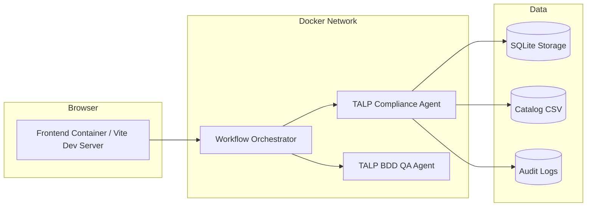

# Deployment

## Prerequisites

- Python 3.11 or later
- Node.js 20 or later
- Docker 24 or later
- Docker Compose v2 or later

## Environment Configuration

The repository uses environment variables per service. The examples below match the current codebase.

### Invest Agent

The Invest Agent is CLI-based and reads the following environment variables:

```env
TALP_AUDIT_LOG_DIR=logs/audit
TALP_LLM_MODEL=gemini-2.5-flash
```

### Compliance Agent

```env
APP_ENV=development
DATABASE_URL=sqlite:///./storage/db/compliance_agent.db
CATALOG_RULES_PATH=data/catalog_rules_v1.csv
AUDIT_LOG_PATH=storage/audit/compliance_runs.jsonl
AGENT_BACKEND=heuristic
```

### BDD QA Agent

```env
QA_APP_NAME=BDD QA Agent
QA_APP_VERSION=0.1.0
QA_API_PREFIX=/api/v1
QA_LOG_LEVEL=INFO
QA_LLM_MODEL=gpt-4o-mini
QA_LLM_API_KEY=replace-me
QA_LLM_TEMPERATURE=0.0
QA_LLM_TIMEOUT_SECONDS=60
```

### Workflow Orchestrator

```env
ORCH_APP_NAME=Workflow Orchestrator
ORCH_APP_VERSION=0.1.0
ORCH_API_PREFIX=/api/v1
ORCH_LOG_LEVEL=INFO
ORCH_USER_AGENT=talp-workflow-orchestrator/0.1.0
ORCH_INVEST_AGENT_BASE_URL=http://invest-agent:8000/api/v1/invest
ORCH_COMPLIANCE_AGENT_BASE_URL=http://compliance-agent:8000/api/v1/compliance
ORCH_BDD_AGENT_BASE_URL=http://bdd-agent:8000/api/v1/qa
ORCH_REQUEST_TIMEOUT_SECONDS=30
ORCH_CONNECT_TIMEOUT_SECONDS=5
ORCH_READ_TIMEOUT_SECONDS=25
ORCH_WRITE_TIMEOUT_SECONDS=25
ORCH_POOL_TIMEOUT_SECONDS=5
ORCH_RETRY_ATTEMPTS=3
ORCH_RETRY_BACKOFF_SECONDS=0.5
ORCH_RETRY_MAX_BACKOFF_SECONDS=5
ORCH_RETRY_JITTER_SECONDS=0.2
```

### Frontend

The frontend uses Vite environment variables:

```env
VITE_APP_NAME=TALP Workflow Frontend
VITE_APP_VERSION=0.1.0
VITE_ORCHESTRATOR_API_BASE_URL=http://localhost:8000/api/v1
VITE_REQUEST_TIMEOUT_MS=30000
VITE_ENABLE_MOCKS=false
```

## .env Examples

Suggested local file layout:

- `talp-invest-agent/.env`
- `talp-compliance-agent/.env`
- `talp-bdd-agent/.env`
- `talp-workflow-orchestrator/.env`
- `talp-workflow-frontend/.env`

## Local Execution

### Backend startup

#### Invest Agent

The Invest Agent is currently CLI-first.

```bash
cd talp-invest-agent
python -m app.main "As a customer, I want to reset my password..."
```

#### Compliance Agent

```bash
cd talp-compliance-agent
uvicorn app.main:app --host 0.0.0.0 --port 8000 --reload
```

#### BDD QA Agent

```bash
cd talp-bdd-agent
uvicorn app.main:app --host 0.0.0.0 --port 8000 --reload
```

#### Workflow Orchestrator

The orchestrator currently provides the typed communication layer and service contracts. The repository does not ship a standalone runtime server for it yet, so treat this as the integration boundary that a future FastAPI shell will expose.

### Frontend startup

```bash
cd talp-workflow-frontend
npm install
npm run dev
```

### Development mode

For development, run services independently so each one can be restarted without affecting the others.

Recommended ports:

- Frontend: `5173`
- Orchestrator: `8000`
- Compliance API: `8000` in its own container or alternate local port if launched alongside another API
- BDD API: `8000` in its own container or alternate local port if launched alongside another API

## Docker Execution

### Build commands

```bash
cd talp-compliance-agent
docker compose build

cd talp-bdd-agent
docker compose build
```

### Startup commands

```bash
cd talp-compliance-agent
docker compose up -d

cd talp-bdd-agent
docker compose up -d
```

### Shutdown commands

```bash
cd talp-compliance-agent
docker compose down

cd talp-bdd-agent
docker compose down
```

### Rebuild procedures

```bash
cd talp-compliance-agent
docker compose down
docker compose build --no-cache
docker compose up -d
```

Repeat the same sequence for the BDD agent.

### Docker architecture



### Deployment details

- Each service should run in its own container.
- Service discovery should use Docker network DNS names, not localhost, for inter-service calls.
- The orchestrator should communicate with downstream services over the internal network using the configured service hostnames.
- The frontend should point to the orchestrator base URL and never call downstream agents directly.

## Networks

Use a shared internal Docker network for the platform services so the orchestrator can resolve the agent containers by name.

## Service discovery

Recommended hostnames within Docker Compose:

- `invest-agent`
- `compliance-agent`
- `bdd-agent`
- `workflow-orchestrator`
- `workflow-frontend`

## Inter-service communication

- Frontend calls the Workflow Orchestrator over HTTP.
- Workflow Orchestrator calls downstream services with HTTPX.
- Compliance Agent persists rule and run data locally.
- BDD QA Agent returns generated scenarios and supporting analysis directly to the orchestrator.
