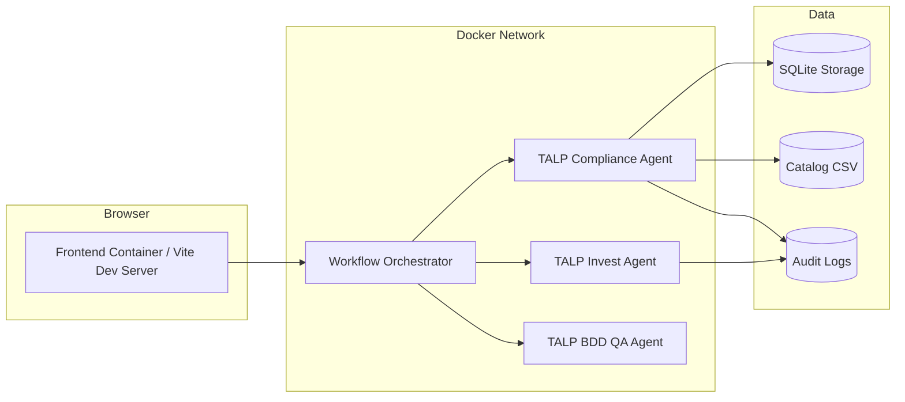

# Deployment

## Prerequisites

- Python 3.11 or later
- Node.js 20 or later
- Docker 24 or later
- Docker Compose v2 or later

## Environment Configuration

The repository uses environment variables per service. The examples below match the current codebase.

### Invest Agent

The Invest Agent exposes a FastAPI API and also supports CLI execution. It reads the following environment variables:

```env
GOOGLE_API_KEY=your-gemini-api-key
# Optional legacy alias accepted by the Invest Agent:
# GEMINI_API_KEY=your-gemini-api-key
TALP_AUDIT_LOG_DIR=logs/audit
TALP_LLM_MODEL=gemini-2.5-flash
TALP_LLM_MAX_TOKENS=1024
TALP_LLM_TIMEOUT_SECONDS=45
TALP_LLM_RETRIES=1
TALP_LLM_THINKING_BUDGET=0
TALP_BACKEND=llm
```

`GOOGLE_API_KEY` is required when `TALP_BACKEND=llm`. `GEMINI_API_KEY` remains supported as a legacy alias for the Invest Agent.
The `TALP_LLM_*` execution limits keep structured Gemini responses short and reduce automatic retry traffic when using free-tier quotas.

### Compliance Agent

```env
ENVIRONMENT=development
DATABASE_URL=sqlite:///./storage/db/compliance_agent.db
CATALOG_RULES_PATH=data/catalog_rules_v1.csv
AUDIT_LOG_PATH=storage/audit/compliance_runs.jsonl
AGENT_BACKEND=heuristic
```

### BDD QA Agent

```env
QA_APP_NAME=BDD QA Agent
QA_APP_VERSION=0.1.0
QA_API_PREFIX=/api/v1
QA_LOG_LEVEL=INFO
QA_LLM_MODEL=gemini-2.5-flash
QA_LLM_BASE_URL=https://generativelanguage.googleapis.com/v1beta/openai
GOOGLE_API_KEY=your-gemini-api-key
# Optional BDD-specific override:
# QA_LLM_API_KEY=your-gemini-api-key
# Optional legacy Gemini alias:
# GEMINI_API_KEY=your-gemini-api-key
QA_LLM_TEMPERATURE=0.0
QA_LLM_TIMEOUT_SECONDS=60
```

Credential resolution order for the BDD QA Agent is `QA_LLM_API_KEY`, then `GOOGLE_API_KEY`, then `GEMINI_API_KEY`. Use `GOOGLE_API_KEY` as the central credential for the full stack unless a BDD-specific override is needed.

### Workflow Orchestrator

```env
ORCH_APP_NAME=Workflow Orchestrator
ORCH_APP_VERSION=0.1.0
ORCH_API_PREFIX=/api/v1
ORCH_LOG_LEVEL=INFO
ORCH_USER_AGENT=talp-workflow-orchestrator/0.1.0
ORCH_INVEST_AGENT_BASE_URL=http://invest-agent:8000/api/v1/invest
ORCH_COMPLIANCE_AGENT_BASE_URL=http://compliance-agent:8000/api/v1/compliance
ORCH_BDD_AGENT_BASE_URL=http://bdd-agent:8000/api/v1/qa
ORCH_REQUEST_TIMEOUT_SECONDS=30
ORCH_CONNECT_TIMEOUT_SECONDS=5
ORCH_READ_TIMEOUT_SECONDS=25
ORCH_WRITE_TIMEOUT_SECONDS=25
ORCH_POOL_TIMEOUT_SECONDS=5
ORCH_RETRY_ATTEMPTS=3
ORCH_RETRY_BACKOFF_SECONDS=0.5
ORCH_RETRY_MAX_BACKOFF_SECONDS=5
ORCH_RETRY_JITTER_SECONDS=0.2
```

### Frontend

The frontend uses Vite environment variables:

```env
VITE_APP_NAME=TALP Workflow Frontend
VITE_APP_VERSION=0.1.0
VITE_ORCHESTRATOR_BASE_URL=http://localhost:8000/api/v1
# Legacy alias still supported:
# VITE_ORCHESTRATOR_API_BASE_URL=http://localhost:8000/api/v1
VITE_REQUEST_TIMEOUT_MS=30000
VITE_ENABLE_MOCKS=false
```

## .env Examples

For Docker Compose, create a root `.env` file so the shared Gemini credential is available to both the Invest and BDD agents:

```env
GOOGLE_API_KEY=your-gemini-api-key
```

The Compose configuration fails fast if `GOOGLE_API_KEY` is missing because both Gemini-backed agents require it in the default LLM mode.

Suggested per-service local file layout when running services independently:

- `talp-invest-agent/.env`
- `talp-compliance-agent/.env`
- `talp-bdd-agent/.env`
- `talp-workflow-orchestrator/.env`
- `talp-workflow-frontend/.env`

## Local Execution

### Backend startup

#### Invest Agent

Run the API service:

```bash
cd talp-invest-agent
uvicorn app.api.main:app --host 0.0.0.0 --port 8001 --reload
```

Optional CLI usage:

```bash
cd talp-invest-agent
python -m app.main "As a customer, I want to reset my password..."
```

#### Compliance Agent

```bash
cd talp-compliance-agent
uvicorn app.main:app --host 0.0.0.0 --port 8002 --reload
```

#### BDD QA Agent

```bash
cd talp-bdd-agent
uvicorn app.main:app --host 0.0.0.0 --port 8003 --reload
```

#### Workflow Orchestrator

```bash
cd talp-workflow-orchestrator
uvicorn app.main:app --host 0.0.0.0 --port 8000 --reload
```

### Using UV

If you use UV as the Python environment and dependency manager, prefix the Python commands with `uv run` from each service directory:

```bash
uv run uvicorn app.main:app --host 0.0.0.0 --port 8000 --reload
uv run python -m app.main "As a customer, I want to reset my password..."
uv run --extra dev pytest
```

Use the service-specific app module shown above for each backend. For example, the Invest Agent API entrypoint is `app.api.main:app`, while the Compliance, BDD, and Orchestrator services use `app.main:app`.

### Frontend startup

```bash
cd talp-workflow-frontend
npm install
npm run dev
```

### Development mode

For development, run services independently so each one can be restarted without affecting the others.

Recommended ports:

- Frontend: `5173`
- Orchestrator: `8000`
- Invest API: `8001`
- Compliance API: `8002`
- BDD API: `8003`

When running services on custom local ports, make sure `ORCH_INVEST_AGENT_BASE_URL`, `ORCH_COMPLIANCE_AGENT_BASE_URL`, and `ORCH_BDD_AGENT_BASE_URL` point to those same ports.

## Docker Execution

### Build commands

```bash
cd .
docker compose build
```

### Startup commands

```bash
cd .
docker compose up -d
```

### Shutdown commands

```bash
cd .
docker compose down
```

### Rebuild procedures

```bash
cd .
docker compose down
docker compose build --no-cache
docker compose up -d
```

### Docker architecture



### Deployment details

- Each service should run in its own container.
- Service discovery should use Docker network DNS names, not localhost, for inter-service calls.
- The orchestrator should communicate with downstream services over the internal network using the configured service hostnames.
- The frontend should point to the orchestrator base URL and never call downstream agents directly.

## Networks

Use a shared internal Docker network for the platform services so the orchestrator can resolve the agent containers by name.

## Service discovery

Recommended hostnames within Docker Compose:

- `invest-agent`
- `compliance-agent`
- `bdd-agent`
- `workflow-orchestrator`
- `workflow-frontend`

## Inter-service communication

- Frontend calls the Workflow Orchestrator over HTTP.
- Workflow Orchestrator calls downstream services with HTTPX.
- Compliance Agent persists rule and run data locally.
- BDD QA Agent returns generated scenarios and supporting analysis directly to the orchestrator.

## Secrets and Credentials

- Never commit real API keys, tokens, or provider credentials to `docker-compose.yml`.
- Use `GOOGLE_API_KEY` as the shared Gemini credential for the default Invest and BDD agents.
- Use `QA_LLM_API_KEY` only when the BDD Agent needs a provider key different from the shared Gemini credential.
- `GEMINI_API_KEY` is supported as a legacy Gemini alias.
- Prefer loading secrets from `.env` files that are gitignored, CI/CD secret stores, or runtime secret managers.
- Rotate any credential immediately if it was exposed in source control history.
