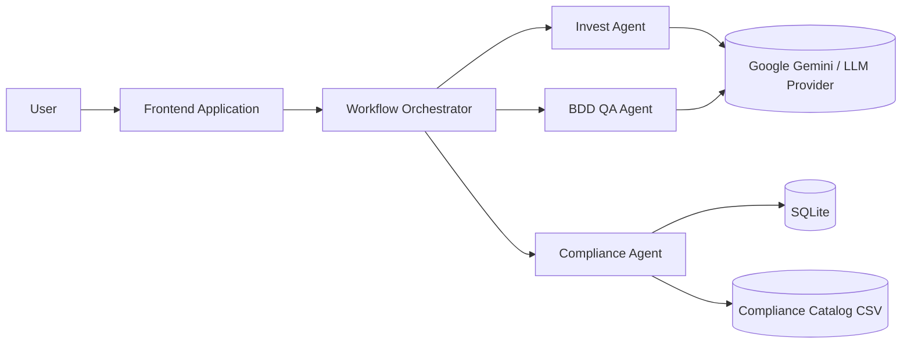
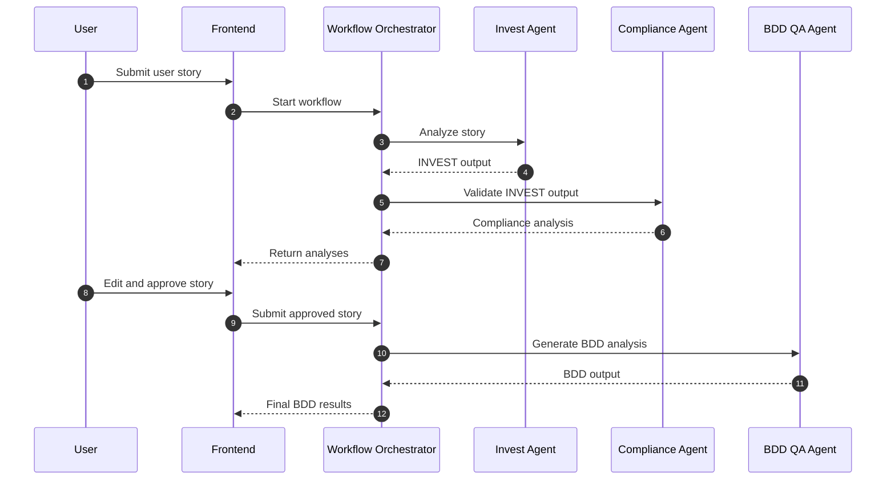
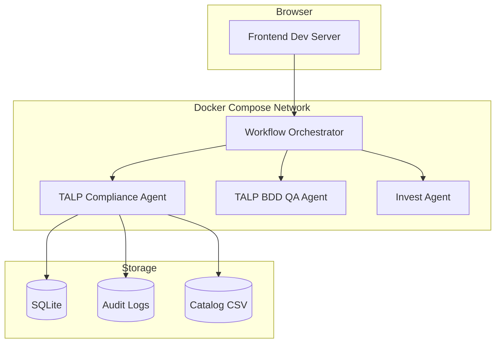
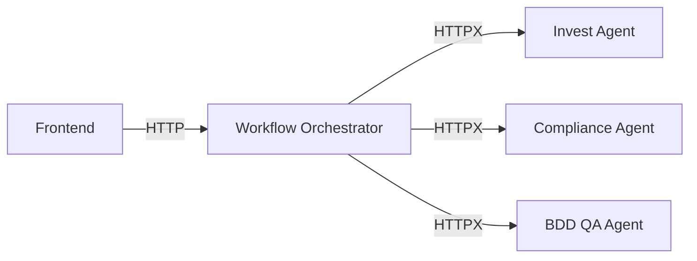
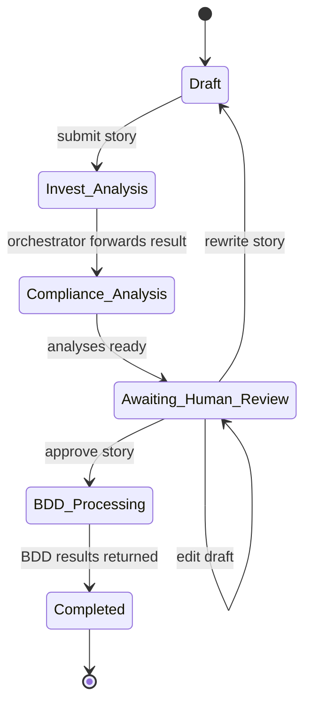
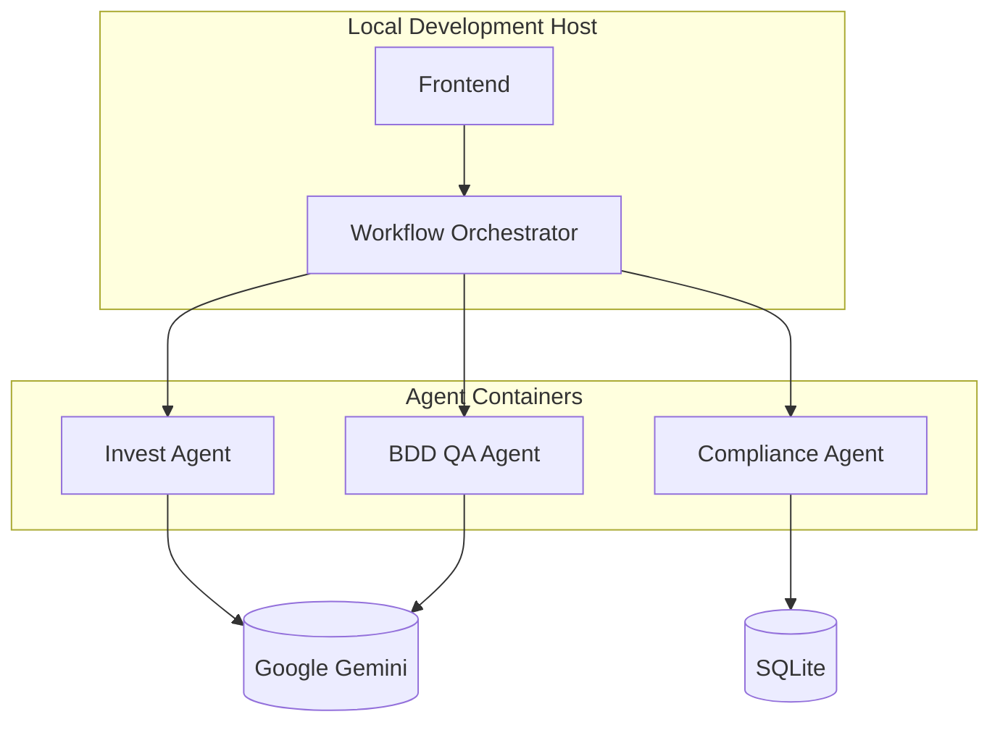

# Diagrams

This file centralizes the Mermaid diagrams used across the repository documentation.

## System Architecture

## Workflow Sequence

## Docker Architecture

## Service Communication

## Human-in-the-Loop Process

## Deployment View

