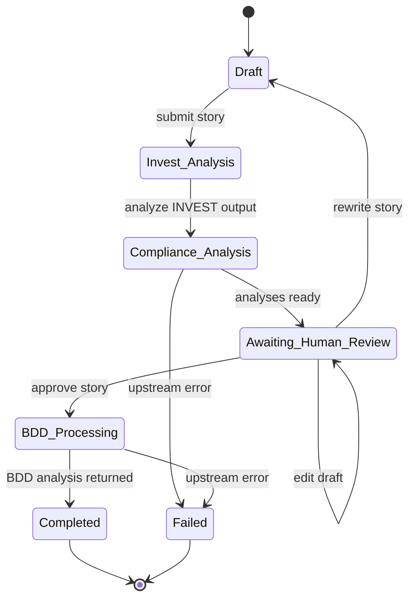
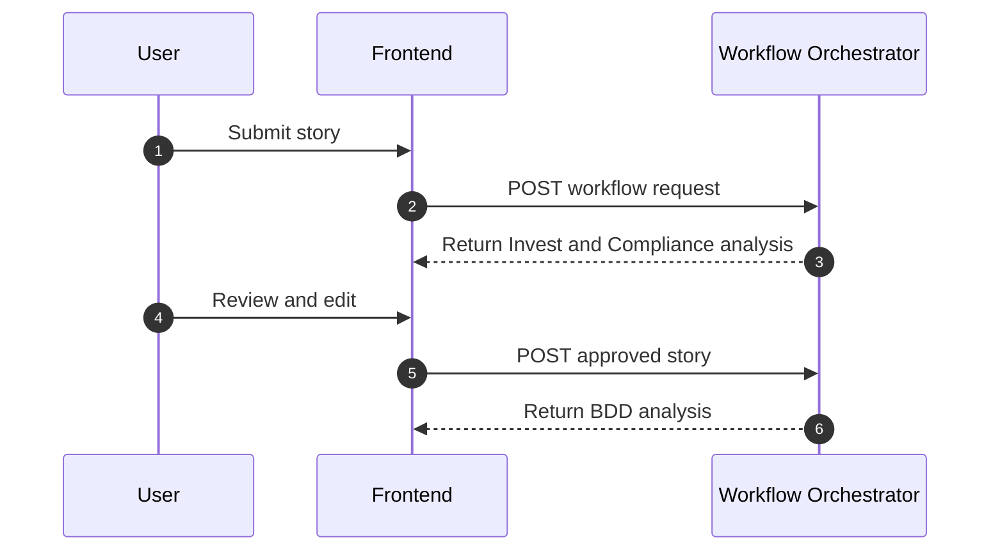
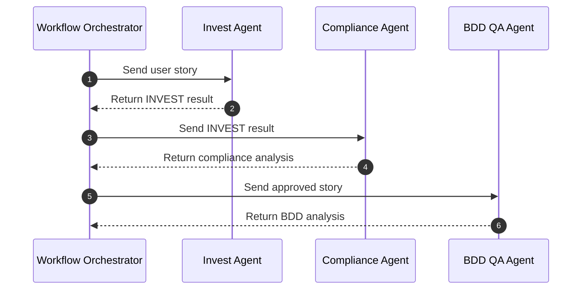
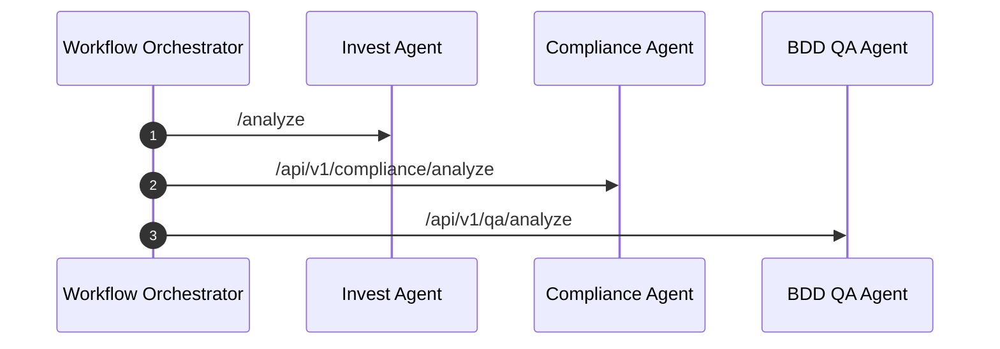

# Workflow

This document describes the end-to-end workflow executed by the platform.

## Complete Workflow

1. The user submits a user story in the frontend.
2. The frontend sends the request to the Workflow Orchestrator.
3. The orchestrator calls the Invest Agent.
4. The orchestrator sends the INVEST output to the Compliance Agent.
5. The frontend receives the combined analyses and displays them for review.
6. A human reviewer approves, edits, or rewrites the story.
7. The approved version is sent back to the Workflow Orchestrator.
8. The orchestrator forwards the approved story to the BDD QA Agent.
9. The frontend displays the final BDD analysis.

## Human-in-the-Loop Stage

The human-in-the-loop stage is a deliberate approval gate between compliance analysis and BDD generation.

Why it exists:

- It allows a domain expert to correct ambiguity or missing context.
- It prevents test generation from being based on an unreviewed story.
- It preserves traceability between the original story and the approved story.

What the reviewer can do:

- Approve the story as-is.
- Edit the current draft.
- Rewrite the story before approval.

The frontend tracks the edited draft separately from the original story, and the workflow state keeps both versions available for auditability.

## State Transitions

## Data Flow Between Services

- The frontend submits a typed user story request to the orchestrator.
- The orchestrator forwards a normalized story to the Invest Agent.
- The Invest Agent returns an `InvestResult`-style final output.
- The orchestrator transforms the INVEST result into the Compliance Agent request format.
- The Compliance Agent returns a structured compliance analysis.
- The frontend lets the reviewer refine the story using the original story and the analyses.
- After approval, the orchestrator sends the final story to the BDD QA Agent.
- The BDD QA Agent returns a BDD summary, scenarios, risks, and refinement questions.

## Mermaid Sequence Diagrams

### Frontend interactions

### Orchestrator flow

### Agent communication

## Workflow Notes

- The workflow is intentionally split into two phases: analysis and approval.
- The human review stage is the only place where the user can modify the story before BDD generation.
- State is persisted in the frontend session storage and can also be recovered from the orchestrator when the workflow route is revisited.
- Any upstream failure should keep the workflow in a recoverable state when possible.
