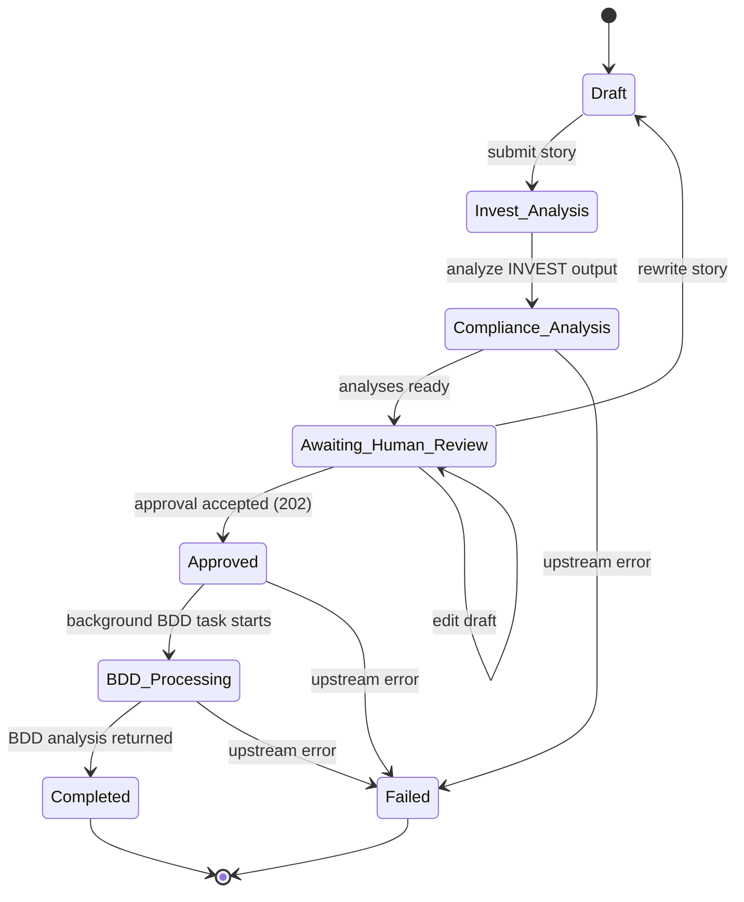
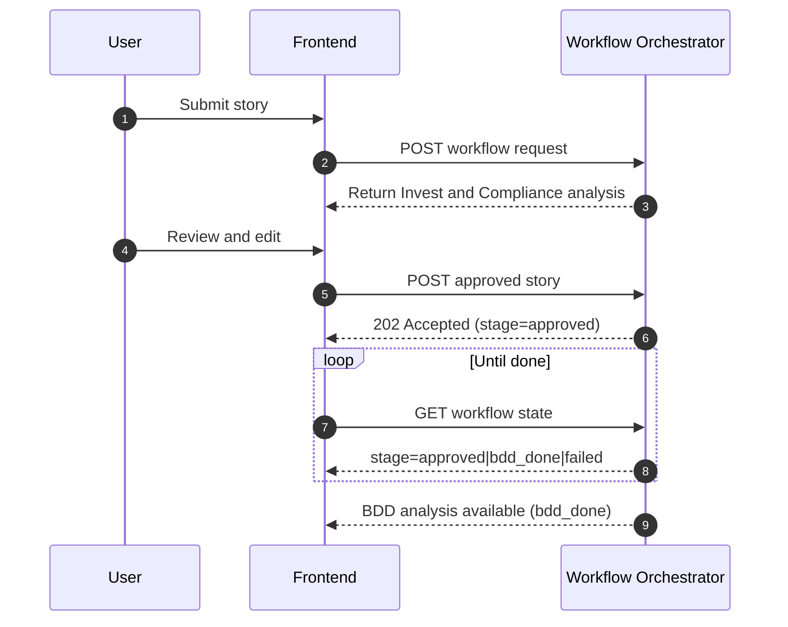
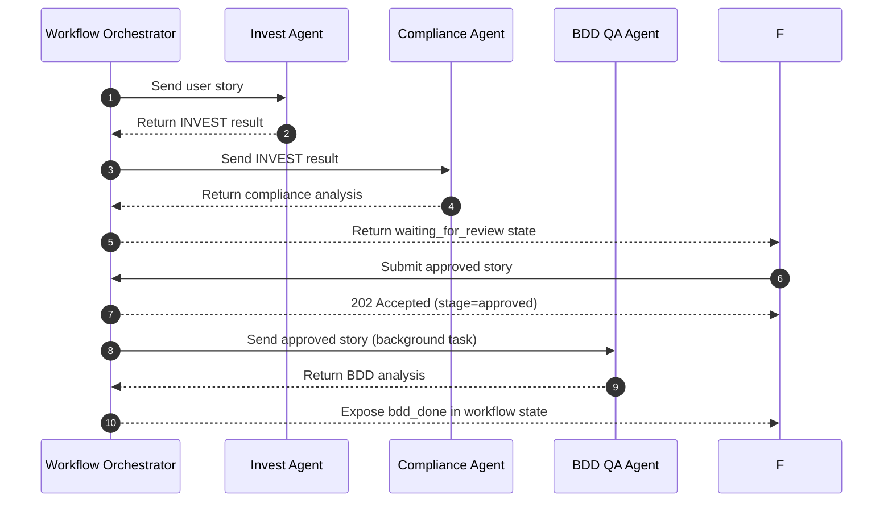
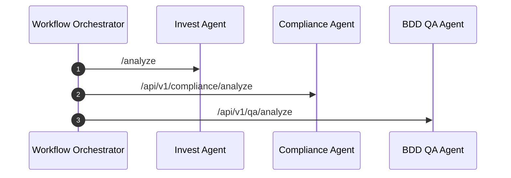

# Workflow

This document describes the end-to-end workflow executed by the platform.

## Complete Workflow

1. The user submits a user story in the frontend.
2. The frontend sends the request to the Workflow Orchestrator.
3. The orchestrator calls the Invest Agent.
4. The orchestrator sends the INVEST output to the Compliance Agent.
5. The frontend receives the combined analyses and displays them for review.
6. A human reviewer approves, edits, or rewrites the story.
7. The approved version is sent back to the Workflow Orchestrator.
8. The orchestrator returns `202 Accepted`, stores stage `approved`, and starts BDD processing in the background.
9. The frontend polls the workflow state until the stage becomes `bdd_done` or `failed`.
10. The frontend displays the final BDD analysis.

## Human-in-the-Loop Stage

The human-in-the-loop stage is a deliberate approval gate between compliance analysis and BDD generation.

Why it exists:

- It allows a domain expert to correct ambiguity or missing context.
- It prevents test generation from being based on an unreviewed story.
- It preserves traceability between the original story and the approved story.

What the reviewer can do:

- Approve the story as-is.
- Edit the current draft.
- Rewrite the story before approval.

The frontend tracks the edited draft separately from the original story, and the workflow state keeps both versions available for auditability.

## State Transitions

## Data Flow Between Services

- The frontend submits a typed user story request to the orchestrator.
- The orchestrator forwards a normalized story to the Invest Agent.
- The Invest Agent returns an `InvestResult`-style final output.
- The orchestrator transforms the INVEST result into the Compliance Agent request format.
- During that transformation, the orchestrator forwards the original rendered story text in `invest_result.metadata.user_story_text` and also keeps the rendered story in `invest_result.summary`.
- The Compliance Agent returns a structured compliance analysis.
- The frontend lets the reviewer refine the story using the original story and the analyses.
- After approval, the orchestrator sends the final story to the BDD QA Agent.
- The BDD QA Agent returns a BDD summary, scenarios, risks, and refinement questions.

## Compliance Matching Behavior

- Compliance rule detection should use the original rendered story text as the primary source for keyword matching.
- This behavior is required because matching only against a reduced INVEST summary can drop domain keywords such as `triagem`, `sinais vitais`, `CID`, `conduta`, or `Manchester`, producing false `non_compliant` results.
- If the original rendered story text is not available, the Compliance Agent falls back to the INVEST summary plus criteria evidence.

## Mermaid Sequence Diagrams

### Frontend interactions

### Orchestrator flow

### Agent communication

## Workflow Notes

- The workflow is intentionally split into two phases: analysis and approval.
- The human review stage is the only place where the user can modify the story before BDD generation.
- Approval is asynchronous: clients should poll `GET /workflows/{workflow_id}` or call `GET /workflows/{workflow_id}/bdd-results` after `bdd_done`.
- `GET /workflows/{workflow_id}/bdd-results` can return `409 Conflict` while BDD processing is still running.
- Frontend keeps workflow snapshots in session storage for UX continuity.
- Current orchestrator state is in-memory and is lost on process restart.
- Any upstream failure should move the workflow to `failed` and preserve the latest recoverable state.
