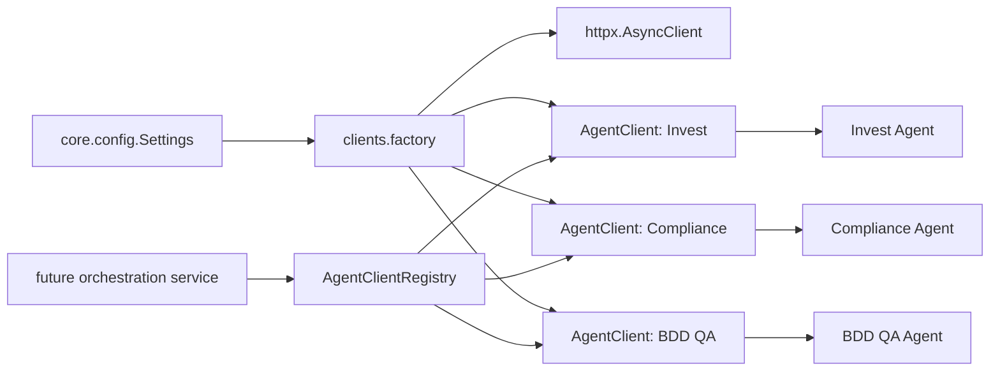

# Communication Layer Architecture

## Purpose

The communication layer isolates all HTTP concerns between the orchestrator and the downstream agents.

It is responsible for:

- Encoding typed request payloads.
- Sending requests with HTTPX.
- Applying timeout and retry policy.
- Parsing typed responses.
- Translating transport failures into domain-specific exceptions.
- Emitting structured logs for each upstream call.

## Recommended Package Structure

```text
app/
  core/
    config.py
    exceptions.py
    logging.py
  clients/
    base.py
    factory.py
    invest.py
    compliance.py
    bdd.py
  schemas/
    common.py
    invest.py
    compliance.py
    qa.py
```

## Dependency Flow



## Interfaces

### `Settings`

Central environment-based configuration for service URLs, timeouts, retry policy, and logging.

### `AgentClient[RequestT, ResponseT]`

Generic HTTP client abstraction.

Responsibilities:

- Serialize a typed request model.
- Perform the HTTP call with timeout and retry policy.
- Validate the typed response model.
- Log the request and response lifecycle.

### `AgentClientRegistry`

Typed lookup container for downstream clients.

Responsibilities:

- Hold all active downstream clients.
- Expose named accessors for the current agents.
- Allow additional agents to be registered later without changing orchestration code.

### Agent-specific request and response models

- `InvestAgentRequest` / `InvestAgentResponse`
- `ComplianceAnalysisRequest` / `ComplianceAnalysisResponse`
- `QARequest` / `QAAnalysisResponse`

## Class Responsibilities

- `core.config.Settings`: loads and validates environment configuration.
- `core.logging.configure_logging()`: installs structured logging.
- `core.exceptions`: defines transport, validation, and retry failures.
- `clients.base.AgentClient`: handles HTTPX calls, retries, parsing, and logging.
- `clients.factory.AgentClientRegistry`: provides named client access and composition.
- `schemas.*`: defines strict typed wire contracts for each downstream service.

## Reusability Strategy

Future agents should be added by:

1. Introducing a new typed request and response model.
2. Creating a client factory entry in `clients.factory`.
3. Registering the client in `AgentClientRegistry`.

The orchestrator service should only depend on the registry, not on individual transport details.
